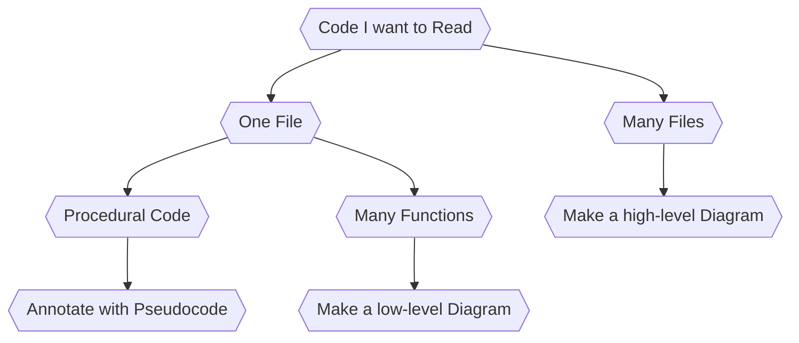

# Coding Methods 101

This document is written assuming that you already know how to write code in some programming language, but you are interested in (1) learning best practices re: how to structure and present your own code, and (2) learning how to understand other people's code!

## Topic Submission

**How I Read Some Code**: Given a new piece of code that you are trying to learn, submit a <1 page description of how you went about reading and understanding the code. If you drew a diagram, show it! If you have a annotated explanation, submit that. Whatever your process was, tell us how you learned what the code did. Include a 1 paragraph summary of what the code does, and a link to the code itself. There is no *wrong* answer, just try it out :)

## Part 1: Reading Code

 
  
How do you eat an elephant?

   One bite at a time!

 

Your goal when reading code is to build a mental model of how it works. Your approach will differ based on time, interest, and goals, your mileage will vary depending on the code complexity, messiness, and language familiarity, and your understanding will improve with practice.

Questions that I ask myself to begin:

0. What is the stated purpose of this code?
1. What libraries are being used?
2. What are the "global" things (functions, variables, constants etc)?
3. Where does the code "start"?
4. What does this expression do?
5. What does this variable hold?
6. How does this code, if at all, connect with the outside world (e.g., API)?
7. What does this code output?
8. Where does it all "end"?

Things I look for before I begin reading code:

1. **Syntax & Semantics:** If I'm unfamiliar, I might quickly refamiliarize myself with the syntax of langauge I'm about to read (e.g., comments, brackets, indexing), as well as the semantics (generally, how variables are named)
2. **Documentation:** Both the online resource, as well as the "in-code" command to understand what the langauge or library does (e.g., man or help functions)
2. **Examples/Tutorials:** A website that shows me good examples of the library in action.
3. **Community:** Is there a dedicated community forum, mailing list, or group that I can learn from and ask for help?
4. **IDE:** Choose an Integrated Development Environment (IDE) that is appropriate for the language you are coding in. These often have built in documentation tools, debugging tools, and standard ways of presenting your code that can help you learn. VScode is a good beginner IDE.

A very rough guide to how I decide what to do next:

### Basics
So, let's say I'm reading a short snippet of code, e.g., a single function. Let's also assume that this code is very minimaly commented/documented (e.g., another student wrote it, and I'm now supposed to build on it). What now?

1. **Comment the code:** As you read through the code, write out in simple english, what you think it is doing. Write as much detail as is helpful for you. If you know that a certain expression is simply adding some numbers, don't have to comment that. But if you know that a set of lines together are working through the process of transposing a matrix for a particular purpose, you may want to write that in a comment. You may even want to write out the math if that is helpful for you.

2. **Write Pseudocode:** If you are having trouble with reading a language that is unfamiliar (e.g., you're reading code in Java but you typically program in Python), then consider writing a "pseudocode" analog, even on a notepad. Here's a delightful tutorial on how to use pseudocode to plan your code flow, but you can use it to also understand how to write out what you think the logic underlying an algorithm you are read is in plain human-readable text: https://www.wikihow.com/Write-Pseudocode

3. **Make a Flowchart:** If the code is more complex and contains control structures like loops and decisions, you may even want to draw out a little flowchart.  I've been enjoying using [Mermaid](https://mermaid.js.org/syntax/flowchart.html) to create simple diagrams in readme docs like this one! The graph above is in mermaid-markdown.

### Making Diagram
A brief introduction to UML and loose-UML.

1. High-Level Diagrams: box and arrow, class diagrams, ERDs, package diagrams

2. Low-Level Diagrams: state machines, use case diagrams, data flow diagrams

3. Generating Diagrams. When you're really dealing with a massive program AND it's open source, you can have some luck with running the entire code base through a professional diagram generator, like [Visual Paradigm](https://www.visual-paradigm.com/)

### Some Strategies to Understand Program Flow

#### 1. Recognize and Backtrack
Good for understanding how a small piece of code works.

> "Find one thing you know the code does, and trace those actions backwards"
Alex Coleman, How to quickly and effectively read other people’s code: https://selftaughtcoders.com/how-to-quickly-and-effectively-read-other-peoples-code/

### 2. Read-Search-Try
Good for trying out new and unfamiliar libraries.

1. Read the manual (or even use man, help(), and other cmds)
2. Look for an example
3. Try it out!

**E.g. To Play with Pandas:**
1. Documentation: Pandas documentation: https://pandas.pydata.org/docs/
2. Examples: Pandas Cookbook: https://github.com/jvns/pandas-cookbook
3. Open up a Jupyter Notebook and try it out!

**E.g. To Play with Matplotlib**
1. Documentation: https://matplotlib.org/stable/api/index.html
2. Examples book: https://matplotlib.org/stable/gallery/index.html
3. You know the drill now :) Try it out!

#### 3. Run-Structure-Dive-Write
A more involved strategy for approaching any complex code base:
>	- (R)un: compile, run, and understand what the code is supposed to do.
>	- Examine (S)tructure: Learn high level structure and review key integration tests.
>	- (D)ive in: Follow key flows and read important data structures.
>	- (W)rite tests: Write tests and prioritize simple features and bug fixes.

Nemil Dalal, One secret to becoming a great software engineer: read code: https://hackernoon.com/one-secret-to-becoming-a-great-software-engineer-read-code-467e31f243b0 (also wins the award for most click-baity post title)

### MOAR Strategies for Reading Code
Tips for Reading Code: http://wiki.c2.com/?TipsForReadingCode
Aria Stewart How to Read Code: https://github.com/aredridel/how-to-read-code
and really, you want to read: http://aredridel.dinhe.net/2015/03/29/how-to-read-source-code/
Sunny Beatteay, How to read code without ripping your hair out: https://medium.com/launch-school/how-to-read-source-code-without-ripping-your-hair-out-e066472bbe8d

## Part 2: Coding Best Practices

### Syntax Best Practices

In programming,  
&nbsp;&nbsp;&nbsp;&nbsp;&nbsp;&nbsp;**sytax** refers to the grammer of your expressions.  
&nbsp;&nbsp;&nbsp;&nbsp;&nbsp;&nbsp;**semantics** refers to the meaning of your expression. 

For example, In English, "Indiana is a planet."* is correct syntactically. It is incorrect semantically.

Best practices will vary from language to language. 

Consider Python...  

The official style guide for python can be a little extra: https://peps.python.org/pep-0008/, but it offers some good advice on how to ensure that readability of your code is valued.

But, some quick lessons include:
- Indent your code in a consistent way, ideally use EITHER 4 spaces OR tabs.
- Break long lines into multiple lines, keeping each line of code <79 characters. You can literally just start a new line and keep going. Binary operators are typically kept at the start of the line.
- Keep your imports neat: libraries are imported one per line, but classes from a single library can be grouped in one line.
- Comment your code!
- Create a "docstring" at the start of all functions, modules, classes, and methods - it's a [specifically formatted comment](https://peps.python.org/pep-0257/) that describes the code.
- For examples of each of these lessons, see [this quick reference](https://learnpython.com/blog/python-coding-best-practices-and-style-guidelines/)

It's important to name your variables in a meaningful manner. While it won't affect the function of your code, it will dramatically improve the readability. Variable naming conventions also vary from language to language, but in Python, it's generally expected that you will use `lowercase` and `lowercase_with_spaces` for your variables. Constants (variables that don't change), are typically `UPPERCASE`. Think about the readability, understandability, and context of your variable names.

### Function Design
I still swear by Dr. David Kay's "Design Recipe" for functions as an excellent starting point for thinking about how to move from idea -> pseudocode -> actual code. Instead of rewriting it, I point you to: https://www.ics.uci.edu/~kay/courses/31/design-recipe.html

### Create Diagrams
See the text in Part 1 on diagramming tools. The same story applies here, creating lightweight diagrams to explain your code can support (1) future you when you come back to look at what you did, (2) collaborators who are trying to read your code and even help you fix it, and (3) future users who may be reading your documentation!

### Use Version Control
If you haven't already started, create a repository for your code and commit regularly. This will ensure that you have a backup of your code, including a full history of all the changes -- if you break something, you can always go back in time! While github is obviously one option, other popular version control tools include [Gitlab](https://gitlab.com/) and [Bitbucket](https://bitbucket.org/).

If you break your repository, this is helpful: https://ohshitgit.com/

### Write Documentation
I use the readme file in my repositories as a "lab notebook" of sorts. You can also use a Jupyter Notebook to serve as a lab notebook and also place it into your repository. This is a great way of getting the documentation party started. Here's an example of a tutorial one of my students wrote that originally started as her lab notebook: https://github.com/ag-informatics/streamflow

Once your project is mature, you can graduate to using a tool like [ReadTheDocs](https://readthedocs.org/) to host your documentation. Here's an example from my lab's work: https://github.com/ag-informatics/pds-docs

## Part 3: Troubleshooting Code || Coming 2024.
For now: Julia Evans, Programming Zines: https://wizardzines.com/comics/

1. Rubber ducking
2. Read the stacktrace - types of errors, how to backtrack
3. Print statements - and other forms of brute forcing output
4. Unit testing - types of tests
5. Asking for Help - forums
6. Code Reviews. Example of a "Bountied" code review request on stackexchange: https://codereview.stackexchange.com/questions/283015/copy-and-pasting-values-from-spreadsheets
