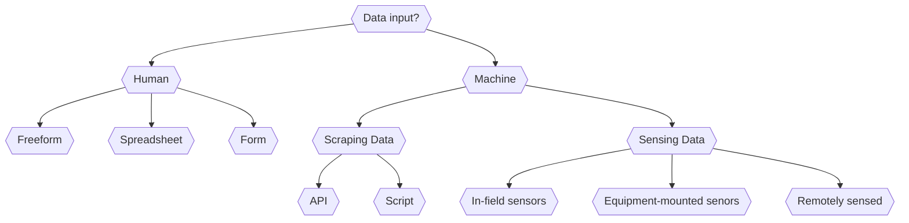

# Data Acquisition

## **READ this Overview Article** 
A light overview of the "IoT challenge" in agriculture: https://ieeexplore.ieee.org/abstract/document/8982747. In this paper, my co-author, Dennis Buckmaster and I, provide a framing of "connectedness" in agriculture, in terms how five categories of "things" we connect in agricultural IoT systems: plants, animals, machines, people, and environments. You will use this framing as you consider data acquisition tools and the data landscape in food and agriculture this week.

There are many digital technologies used for data acquisition in food and agriculture. One way of categorizing them is in terms of the means of data input or acquisiion. Is the data entered into a user interface by a human or algorithm? If the data comes from an algorithm, is it connected to a sensor? Or is it scraping a website? If it's connected to a sensor, is it in a field, on a piece of equipment, on a satellite in space? Ultimately, we are interested in the flow of data from point of observation (plant, field, market) to a place where it can be used. A **rough** approximation of this concept is flowcharted below (this diagram is an experiment, let me know if it makes sense). 

## **SKIM these Resources** 
An overview of data acquisition methods, tools, and research applications. Reading this document should suffice, though you may want to skim through some of the videos to inform your understanding of the space where you have gaps.

0. **Freeform** observations, i.e. data, are often collected in an unstructured manner. From using paper-based notebooks, text-messaging yourself, taking a quick photograph, and using digital note-taking application, there are an endless number of ways in which humans collect freeform, or unstructured data. 

1. **Spreadsheets** are one of the most commonly used data collection tools in agriculture. From farmer use of spreadsheets to log activities, to agricultural researcher use of spreadsheets to manage data, there are many examples of spreadsheet use. 

	- Dr. Dennis Buckmaster, of OATS & ABE at Purdue provides a fabulous overview of the power of spreadsheets in a series of videos on [Digging into the Data Pipeline](https://ag.purdue.edu/digital-ag-resources/fall-webinar-series-digging-into-the-data-pipeline/). describing for example, [how to create interactive spreadsheets using the google sheets](https://ag.purdue.edu/digital-ag-resources/creating-savvy-spreadsheets/).

	- [Curtis Stone](https://theurbanfarmer.co/), a Canadian urban farmer has a fantastic set of learning materials that he shares through his urban farming blog, youtube videos, and book. This short video is a great overview of how he uses [spreadsheets for farm management](https://youtu.be/S2hXlswMwZQ).

	- While Microsoft Excel and Google Sheets are the most common spreadsheet tools, [Airtable](https://airtable.com/) is worth a try for data management as it offers a platform that hybridizes databases and spreadsheets, and includes the power of forms. My lab does a lot of data collection using Airtable and I can show a quick demo in class if that is helpful.

2. **Forms** are used for more structured data input and are often used in a complementary manner to spreadsheets since they can be more mobile-friendly. 
	- [Kobo Toolbox](https://www.kobotoolbox.org/) is a form-based data collection tool. My collaborators in the Precision Sustainable Agriculture collective now use Kobo to enable our large network of on-farm researchers to collect structured data. You can see a [quick overview/demo here](https://youtu.be/h8NNsdYILlU). Kobo Toolbox is part of a larger family of tools based on the [Open Data Kit](https://getodk.org/) that is instantiated by many open source developers to create data collection forms for different communities. 

	- The [SurveyStack](https://app.surveystack.io/) platform is another example of a form-based data collection toolbox. In this case, the [OurSci](https://www.our-sci.net/) team has developed it for citizen science and public research applicaitons. You can see a really interesting example of how a team of researchers have used this data platform for participatory research in Malawi in this [case study video](https://youtu.be/0NdNST_ewTw).

	- Finally, [here's an example](https://youtu.be/qd7lDGa2l8U) of how the ESRI toolbox, including Survey123 (also based on ODK) can be used in goverment fieldwork and data collection use cases.

3. **Scripting & APIs** are methods to automatically pull data from different types of data repositories, from websites to databases. Consider [this list of public data sources](http://www.aginformaticslab.org/ag-informatics-course/module2/lecture2.1.html#/28)(those of you who were in ASM 591 in Fall 2021 will recognize the slide deck from our first python module). Methods to access these data include:

	- Downloading a CSV/JSON file from the a web-interface to the database. For example, the [FAO Global Food & Ag Data website](http://www.fao.org/faostat/en/)

	- You can use a python library like [Beautiful Soup](https://www.crummy.com/software/BeautifulSoup/) to scrap data from a website - this is a powerful way of scraping websites that weren't designed from easy data download.

	- You can use a unix command line tool like [WGET](https://www.gnu.org/software/wget/) or [CURL](https://curl.se/) to download large sets of data from websites, such as libraries of PDFs or images. These tools are great for creating automated scripts (e.g. [CRON jobs](https://en.wikipedia.org/wiki/Cron)) to scrape data.

	- Finally, many data repositories are beginning to offer in-built [APIs](https://en.wikipedia.org/wiki/API) to allow users to programmatically download data. These can vary in complexity. [SSURGO](https://sdmdataaccess.nrcs.usda.gov/) for instance has an extensive set of web services to allow users to write SQL queries to access data, but it can be daunting to navigate. There is a growing interest in building APIs to empower developers to access food and agricultural data via APIs that are much easier to operate. However, they are often paywalled as there are many industry-led implementations: for example, [Ag Analytics](https://ag-analytics.portal.azure-api.net/docs/services/ssurgo-soil-v2/operations/post-ssurgo?) offers a SSURGO API, but you need to buy a license to use their API to access otherwise publicly accessible SSURGO data as they have done the some pre- and post-processing you may have otherwise had to do. While this can make it easy for those with a healthy budget to access public datasets, it can be a barrier for researchers and many other agricultural data stakeholders.

	- Here's a [short introduction video](https://www.youtube.com/watch?v=Yzx7ihtCGBs) to what an API is and how it works. [A little more detail here](https://www.youtube.com/watch?v=lsMQRaeKNDk). And finally , if you'd like to "try out" an API to get a better sense for what they are and how they work, I recommend this 2 hour course on [APIs for Beginners :)](https://www.youtube.com/watch?v=GZvSYJDk-us).

4. **In-field and equipment mounted sensing systems.**  The IoT space tends to focus heavily on this class of data collection systems: sensors connected to micro-computers that send data from field to a web server. Sometimes the sensor is in the field, an a node-gatway system is used to send data to the server. On the other hand we have cameras and sensing tools mounted on UAVs, again, beaming data back to a server. Some examples:

	- Gateway-node wireless data collection system for environmental sensing: https://acsess.onlinelibrary.wiley.com/doi/10.1002/agg2.20219. This article showcases the electrical engineering involved in putting together an in-field sensing system, providing insight how such a system can be designed and built.

	- Dr. Jake Hosen in FNR at Purdue has a set of interesting learning materials that also showcase how ecological sensing systems can be built: https://jakehosen.github.io/Ecological_Sensors/index.html

	- The Purdue Digital Agriculture seminar series showcases many projects where researchers have used, built, and are developing in-field systems in their work, e.g., [IoT Networks: Sensors and Data Visualization](https://youtu.be/IOZkiJK4Plw), and this video on [Practical Applications for UAVs](https://www.youtube.com/watch?v=HnSgC0AdbLk&list=PLVrv1vgCwEkntPHttMSdY0-nzBCHlhjBJ&index=39) There are lots more videos on the Purdue Ag youtube channel. For an overview, you can check out Dennis Buckmasters [short video on Purdue's IoT testbed capacity and progress as of 2020](https://www.youtube.com/watch?v=Zi31BqoFaTE&list=PLVrv1vgCwEkntPHttMSdY0-nzBCHlhjBJ&index=3).

5. **Remote sensing systems**. I include this here for the sake of completeness, but many of you have already taken GIS and remote sensing courses here at Purdue that overview the different types of remote sensing data and the ways in which these data are obtained and subsequently used.

## Optional Reading
Acting like an algorithm: digital farming platforms and the trajectories they (need not) lock-in: https://link-springer-com.ezproxy.lib.purdue.edu/article/10.1007/s10460-020-10032-w

# TOPIC Analysis Submission

Instead of a topic analysis, this week, I ask you to provide **1 page** overview of what type of data acquisition you need/want to engage in your research. You will submit this on Brightspace. Here's the questions I want you to answer:

	1) What type of data will you need to collect in your research? 

	2) Are there any types of "things" you need to connect (consder the framing from the paper at the start of this page: connecting plants, animals, machines, people, and environments)?

	3) What types of data acquisition tools or methods do you think you might need to use or build?

	4) What challenges do you anticipate? What resources are you looking for?

	5) Questions: A list of 3-5 questions for the in-class discussion.

# Moderator's Discussion Brief
Author: [name]
GitHub: [username]

# Overview of the topic

*insert 1-2 paragraphs here*

# Short Synopsis of Readings

*For each cluster of resources provided, create a <1 paragraph summary.]*

# Summary of Key Takeaways from the Materials

*4-5 key takeways, a few sentences to one paragraph each*

# Discussion Questions

*>4-5 questions*

# Further Resources

*>2-3 resources you'd like to share*

# Discussion Notes and Feedback
Note taker: [name]

[notes from the class discussion]

# FYI for Moderator: Creating a Pull Request

*IMPORTANT:*

Before beginning your work ensure that you first create a "fork" from the course GitHub page. This creates a copy of the ag-informatics-seminar course content onto *your* GitHub repository. From this point you should git clone this repository onto your device and proceed by making edits to the desired file in that location. Below are three YouTube videos that I found helpful when learning how to create a pull request, additionally I also encountered some issues when using Terminal git commands and was able to fairly easily find solutions on stackoverflow.com . Let me know if you have any additional questions!

https://youtu.be/rgbCcBNZcdQ

https://youtu.be/npnfDwmHKhY

https://youtu.be/8A4TsoXJOs8
