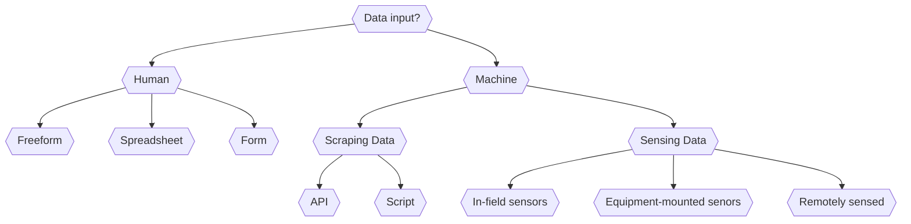

# Data Acquisition

## **READ this Overview Article** 
A light overview of the "IoT challenge" in agriculture: https://ieeexplore.ieee.org/abstract/document/8982747. In this paper, my co-author, Dennis Buckmaster and I, provide a framing of "connectedness" in agriculture, in terms how five categories of "things" we connect in agricultural IoT systems: plants, animals, machines, people, and environments. You will use this framing as you consider data acquisition tools and the data landscape in food and agriculture this week.

There are many digital technologies used for data acquisition in food and agriculture. One way of categorizing them is in terms of the means of data input or acquisiion. Is the data entered into a user interface by a human or algorithm? If the data comes from an algorithm, is it connected to a sensor? Or is it scraping a website? If it's connected to a sensor, is it in a field, on a piece of equipment, on a satellite in space? Ultimately, we are interested in the flow of data from point of observation (plant, field, market) to a place where it can be used. A **rough** approximation of this concept is flowcharted below (this diagram is an experiment, let me know if it makes sense). 

## **SKIM these Resources** 
An overview of data acquisition methods, tools, and research applications. Reading this document should suffice, though you may want to skim through some of the videos to inform your understanding of the space where you have gaps.

0. **Freeform** observations, i.e. data, are often collected in an unstructured manner. From using paper-based notebooks, text-messaging yourself, taking a quick photograph, and using digital note-taking application, there are an endless number of ways in which humans collect freeform, or unstructured data. 

1. **Spreadsheets** are one of the most commonly used data collection tools in agriculture. From farmer use of spreadsheets to log activities, to agricultural researcher use of spreadsheets to manage data, there are many examples of spreadsheet use. 

	- Dr. Dennis Buckmaster, of OATS & ABE at Purdue provides a fabulous overview of the power of spreadsheets in a series of videos on [Digging into the Data Pipeline](https://ag.purdue.edu/digital-ag-resources/fall-webinar-series-digging-into-the-data-pipeline/). describing for example, [how to create interactive spreadsheets using the google sheets](https://ag.purdue.edu/digital-ag-resources/creating-savvy-spreadsheets/).

	- [Curtis Stone](https://theurbanfarmer.co/), a Canadian urban farmer has a fantastic set of learning materials that he shares through his urban farming blog, youtube videos, and book. This short video is a great overview of how he uses [spreadsheets for farm management](https://youtu.be/S2hXlswMwZQ).

	- While Microsoft Excel and Google Sheets are the most common spreadsheet tools, [Airtable](https://airtable.com/) is worth a try for data management as it offers a platform that hybridizes databases and spreadsheets, and includes the power of forms. My lab does a lot of data collection using Airtable and I can show a quick demo in class if that is helpful.

2. **Forms** are used for more structured data input and are often used in a complementary manner to spreadsheets since they can be more mobile-friendly. 
	- [Kobo Toolbox](https://www.kobotoolbox.org/) is a form-based data collection tool. My collaborators in the Precision Sustainable Agriculture collective now use Kobo to enable our large network of on-farm researchers to collect structured data. You can see a [quick overview/demo here](https://youtu.be/h8NNsdYILlU). Kobo Toolbox is part of a larger family of tools based on the [Open Data Kit](https://getodk.org/) that is instantiated by many open source developers to create data collection forms for different communities. 

	- The [SurveyStack](https://app.surveystack.io/) platform is another example of a form-based data collection toolbox. In this case, the [OurSci](https://www.our-sci.net/) team has developed it for citizen science and public research applicaitons. You can see a really interesting example of how a team of researchers have used this data platform for participatory research in Malawi in this [case study video](https://youtu.be/0NdNST_ewTw).

	- Finally, [here's an example](https://youtu.be/qd7lDGa2l8U) of how the ESRI toolbox, including Survey123 (also based on ODK) can be used in goverment fieldwork and data collection use cases.

3. **Scripting & APIs** are methods to automatically pull data from different types of data repositories, from websites to databases. Consider [this list of public data sources](http://www.aginformaticslab.org/ag-informatics-course/module2/lecture2.1.html#/28)(those of you who were in ASM 591 in Fall 2021 will recognize the slide deck from our first python module). Methods to access these data include:

	- Downloading a CSV/JSON file from the a web-interface to the database. For example, the [FAO Global Food & Ag Data website](http://www.fao.org/faostat/en/)

	- You can use a python library like [Beautiful Soup](https://www.crummy.com/software/BeautifulSoup/) to scrap data from a website - this is a powerful way of scraping websites that weren't designed from easy data download.

	- You can use a unix command line tool like [WGET](https://www.gnu.org/software/wget/) or [CURL](https://curl.se/) to download large sets of data from websites, such as libraries of PDFs or images. These tools are great for creating automated scripts (e.g. [CRON jobs](https://en.wikipedia.org/wiki/Cron)) to scrape data.

	- Finally, many data repositories are beginning to offer in-built [APIs](https://en.wikipedia.org/wiki/API) to allow users to programmatically download data. These can vary in complexity. [SSURGO](https://sdmdataaccess.nrcs.usda.gov/) for instance has an extensive set of web services to allow users to write SQL queries to access data, but it can be daunting to navigate. There is a growing interest in building APIs to empower developers to access food and agricultural data via APIs that are much easier to operate. However, they are often paywalled as there are many industry-led implementations: for example, [Ag Analytics](https://ag-analytics.portal.azure-api.net/docs/services/ssurgo-soil-v2/operations/post-ssurgo?) offers a SSURGO API, but you need to buy a license to use their API to access otherwise publicly accessible SSURGO data as they have done the some pre- and post-processing you may have otherwise had to do. While this can make it easy for those with a healthy budget to access public datasets, it can be a barrier for researchers and many other agricultural data stakeholders.

	- Here's a [short introduction video](https://www.youtube.com/watch?v=Yzx7ihtCGBs) to what an API is and how it works. [A little more detail here](https://www.youtube.com/watch?v=lsMQRaeKNDk). And finally , if you'd like to "try out" an API to get a better sense for what they are and how they work, I recommend this 2 hour course on [APIs for Beginners :)](https://www.youtube.com/watch?v=GZvSYJDk-us).

4. **In-field and equipment mounted sensing systems.**  The IoT space tends to focus heavily on this class of data collection systems: sensors connected to micro-computers that send data from field to a web server. Sometimes the sensor is in the field, an a node-gatway system is used to send data to the server. On the other hand we have cameras and sensing tools mounted on UAVs, again, beaming data back to a server. Some examples:

	- Gateway-node wireless data collection system for environmental sensing: https://acsess.onlinelibrary.wiley.com/doi/10.1002/agg2.20219. This article showcases the electrical engineering involved in putting together an in-field sensing system, providing insight how such a system can be designed and built.

	- Dr. Jake Hosen in FNR at Purdue has a set of interesting learning materials that also showcase how ecological sensing systems can be built: https://jakehosen.github.io/Ecological_Sensors/index.html

	- The Purdue Digital Agriculture seminar series showcases many projects where researchers have used, built, and are developing in-field systems in their work, e.g., [IoT Networks: Sensors and Data Visualization](https://youtu.be/IOZkiJK4Plw), and this video on [Practical Applications for UAVs](https://www.youtube.com/watch?v=HnSgC0AdbLk&list=PLVrv1vgCwEkntPHttMSdY0-nzBCHlhjBJ&index=39) There are lots more videos on the Purdue Ag youtube channel. For an overview, you can check out Dennis Buckmasters [short video on Purdue's IoT testbed capacity and progress as of 2020](https://www.youtube.com/watch?v=Zi31BqoFaTE&list=PLVrv1vgCwEkntPHttMSdY0-nzBCHlhjBJ&index=3).

5. **Remote sensing systems**. I include this here for the sake of completeness, but many of you have already taken GIS and remote sensing courses here at Purdue that overview the different types of remote sensing data and the ways in which these data are obtained and subsequently used.

## Optional Reading
Acting like an algorithm: digital farming platforms and the trajectories they (need not) lock-in: https://link-springer-com.ezproxy.lib.purdue.edu/article/10.1007/s10460-020-10032-w

# SUBMISSION

Instead of a topic analysis, this week, I ask you to provide **1 page** overview of what type of data acquisition you need/want to engage in your research. You will submit this on Brightspace. Here's the questions I want you to answer:

	1) What type of data will you need to collect in your research? 

	2) Are there any types of "things" you need to connect (consder the framing from the paper at the start of this page: connecting plants, animals, machines, people, and environments)?

	3) What types of data acquisition tools do you think you might need to use or build?

	4) What challenges do you anticipate? What resources are you looking for?

	5) Questions: A list of 3-5 questions for the in-class discussion.

# Moderator's Discussion Brief
Author: Md. Samiul Basir

GitHub: https://github.com/mbasir25 

## Overview of the Topic
The discussion topic of Data Acquisition talks about the data acquisition systems existing in agricultural field. The data acquisition can be done by human or machines. Human data acquisition is done by free forms as paper notes. It is mostly handwritten and year-old method to record data. It involves keeping notes in a notebook, structured tables to write the records in a particular place, on sticky notes or on a small field book. The process of keeping notes has been replaced by spreadsheets that can easily arrange the data for further analysis. Spreadsheets can be used for direct data entry or for keep the data archived in a structured way after using free form notes. The field data recording notebooks are now being replaced by automated forms or apps that sends the data to a database or a spreadsheet using internet. Human data collection is now in a new dimension as mobile applications are used to collect data. 
Machines can gather data using APIs and scripts to collect data from a database or website. It  is called scraping and this method is an effective way to get data that is recorded previously by others. APIs like “SSURGO” of NRCS, USGS is an API to get soil data from all over the US. To get data using scripts, there are libraries that can download required data from remote databases and websites. Beautiful Soup  is an example of python libraries that does this job. CSV/JSON files can be downloaded directly from websites. NOAA database offers this opportunity. There is also another way to get data using Unix command line tool like WGET or CURL to download large sets of data from websites. Machine gathers data directly using sensors from fields or from any moving vehicles as a mounted device. Microcontrollers are used for this job that operates sensors and stores the data. Microcontrollers can send the data via cellular network, radio signals or using internet if it is IoT programmed. Machine can also get data by remote sensing. There is a bunch of satellite data available and can generated using satellite sensing. Use of UAV to get data is being popular in agricultural sector. 
The Article titled ‘Growing Plants, Raising Animals, and Feeding Communities through Connected Agriculture: An IoT Challenge’ discussed the use of IoT to manage three different types of farms. The data acquisition method is automated, and all the three farms uses the data for decision support and better management. The authors mentioned ‘agricultural connectedness’ and its five components that was seen from those three farms. They also discussed the challenge to establish IoT in farming to be the financial barrier and the infrastructure constraint of using internet. The article also proposes some design opportunities for successful establishment of IoT in agriculture.

## Short Synopsis of Materials

The term ‘data acquisition’ is a widespread term. It can be classified in two sections depending on who is collecting the data. Data is collected directly by Human and using machines.  
### Data collection by Human:
Data acquisition by human can be done on papers using freeform notes, Structured tables or questionnaires, sticky notes or small field logbooks, those tools are hard to get insights and can not be shared with others easily if needed. This problem was solved introducing computerized spreadsheets in the place of logbook to keep records. Recording data from field has become easier using digital forms and apps in smartphones and tablets.
 
**Spreadsheets:** Spreadsheets are the most popular and easy method of record keeping and data acquisition. Spreadsheets are interoperable and they makes the opportunity to get insights from the gathered data easily by analyzing the data. There has been tremendous improvement in use of spreadsheets as automated spreadsheets are available. Microsoft offers interactive excel spreadsheet to record data using a button based interface. Similarly, Google offers a scripted pipeline of data from forms to spreadsheet using “Macro”. Spreadsheets got a new journey of database integration with forms. Airtable is an example of hybrid spreadsheets of this genre. 

**Forms:** Forms are simple to create and useful for collecting data via user input. Google provides the easiest web forms. There are other more advanced data collection technologies available. One of them is the Kobo Toolkit. It may also be used to record places with data. SurveyStack is another data collection tool that is commonly used by researchers. Using this form-based application, research data may be collected in an orderly manner. Survey123 (also based on ODK) is part of the SRI toolbox and may be used in government fieldwork and data collecting use cases.

### Data collected by Machine
Machines collects data by using scraping website or databases, by direct sensing from fields using in field sensors or instrument mounted devices and by remote sensing using satellite and UAVs/ robots. 

**Scraping:** Scraping is an efficient way of acquiring data. It entails downloading directly from websites and databases such as the FAO Global Food & Ag Data website. APIs are very easy for obtaining data since they employ techniques such as SQL queries. "SSURGO" from the NRCS, USGS offers an API for obtaining soil data from all across the United States. There are libraries that can download essential data from distant databases and websites to be used with scripts. Beautiful Soup is an example of a Python library that does this functionality. Some websites provide direct access to CSV/JSON files. This possibility is provided by the NOAA database. Another method for obtaining data is to use a Unix command line program such as WGET or CURL to download big amounts of data from websites.

**Sensing:** Data is sensed by the machine using sensors placed on the field or mounted on an equipment. This process involves uses of Microcontrollers like (Arduino, Raspberry Pi etc). The most promising methos of data acquisition using data sensing is the IoT system that leads to an automated flow of data from field to database. Data acquisition using Microcontrollers can also be done by string in an SD card and extracting data from that. The paper titled “ Gateway-node wireless data collection system for environmental sensing” shows the full process of data acquisition using microcontrollers and IoT. The authors mentioned a programmed Arduino operated for gathering data from field, storing it into a SD card and timely uploading the data to a database. An example of using IoT and Microcontrollers is the ISOBLUE and LoRa gateway. 

**Remote sensing:** It’s a secondary data acquisition process. The data gathered in this method are not always direct inputs, in many cases, they are derived data from physical/analog signals. This method involves satellite data and UAV generated data. 

### Paper: Challenges in IoT:

The Article titled ‘ Growing Plants, Raising Animals, and Feeding Communities through Connected Agriculture: An IoT Challenge’ discussed the use of IoT to manage three different types of farms. The data acquisition method is automated and all the three farms uses the data for decision support and better management. The authors mentioned ‘agricultural connectedness’ and its five components that was seen from that three farms. They also discussed the clallange to establish IoT in farming to be the financial barrier and the infrastructure constraint of using internet. The article also proposes some design opportunities for successful establishment of IoT in agriculture.

## Summary of Key Takeways from the Materials

**Paper records are being replaced by digital techniques:** As paper records are not user friendly in terms of analysis and interoperability, they are being replaced by digital spreadsheets and databases.

**Spreadsheets are easy but hybrid forms are more convenient:** Spreadsheets and forms, in the form of interactive and automated are easy to operate, but hybrid systems as adds the flavor of using databases, are more convenient and user friendly.

**Digital records allow interoperability:** Digital files and records can be shared or operated from remote and can be accessible by others involved in that work. Also, they offer analysis opportunities and decision insights.
Scraping is hard but effective technique, allows more interactive data acquisition applications: Data that are collected by others and stored in a remote database or website, can be accessible by scraping. This involves scripting, sql queries or other add-ons but they are effective to get such kind of data.

**Involvement of smartphone is a big leap:** Smartphones made the data acquisition process easier as there are opportunities of using forms or apps.
Automated farms are not the reality: The three farms mentioned in the paper of Buckmaster and Ankita has proven that automated farms are not dreams but reality. The farms are monitored and managed using IoT and data driven decision support tools.

## Discussion Questions

Is getting data by scrapping a valid and reliable method always? 
	-is there any concern of data availability?
	- is there any concern of data accessibility?

Are there any Constraints of using spreadsheet and forms?

Any data security or Data Sovereignty issue in using any tool?
		- Farm owner using a 3rd Party tool may lose his ownership 		   	  or control over data.

## Further Resources

# Data aquisition tool : ISOBlue
Layton, A.W., Balmos, A.D., Sabpisal, S., Ault, A., Krogmeier, J.V. and Buckmaster, D., 2014. ISOBlue: An open source project to bring agricultural machinery data into the cloud. In 2014 Montreal, Quebec Canada July 13–July 16, 2014 (p. 1). American Society of Agricultural and Biological Engineers. DOI: 10.13031/aim.20141929380

# Mobile data collection app
McLester, E. and Piel, A.K., 2021. Mobile data collection apps. Conservation Technology, p.177. DOI: 10.1093/oso/9780198850243.003.0009 

# IoT in data gathering
Morais, R., Mendes, J., Silva, R., Silva, N., Sousa, J.J. and Peres, E., 2021. A versatile, low-power and low-cost IoT device for field data gathering in precision agriculture practices. Agriculture, 11(7), p.619. DOI: https://doi.org/10.3390/agriculture11070619

# Remote sensing in data aquisition
Tsouros, D.C., Triantafyllou, A., Bibi, S. and Sarigannidis, P.G., 2019, May. Data acquisition and analysis methods in UAV-based applications for Precision Agriculture. In 2019 15th International Conference on Distributed Computing in Sensor Systems (DCOSS) (pp. 377-384). IEEE.DOI: 10.1109/DCOSS.2019.00080 

## Discussion Notes and Feedback
1. Getting data if difficult using APIs, personal contact such as email can be a good option.

2. Use of available datasets like IRIS for image data is a good fit as an introductory dataset for image analysis and model development

3. Data security is an unsolved question in the design of open agriculture/

4. Decision of which data to be collected and selection of important data for a purpose is related. It is hard to say which data are important without knowing their relevance. So, the data collectors prefer to collect all possible data. 

5. Storage of A huge set of data is a problem. Again, data that are seemed to be statistically unimportant, may be relevant physically. 
(Will be updated…) 
