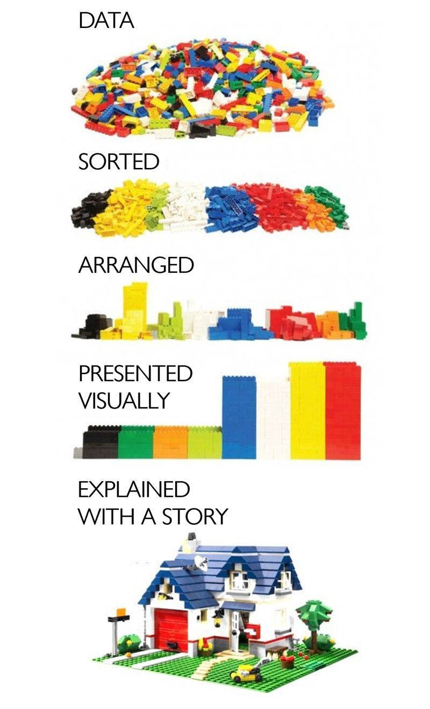

# Data Analysis

The goal of data science can in many ways be described by the image below:

That said, the types of analytics you will want to try out will depend on the type of data you are dealing with. In this section, I provide an overview document + set of resources for three types of data: quantitative, spatial, and image data, to get you thinking in this manner.  

Another way to think about data analysis, is based on the types of questions you are asking of the data. 

- Descriptive analytics: What happened?
- Diagnostic analytics: Why did it happen?
- Predictive analytics: What happens if?
- Prescriptive analytics: How to make it happen? 

These terms have been around for a while: There are many articles that discuss them, including, for instance: https://link.springer.com/chapter/10.1007/978-3-030-04506-7_3 that may be, at least, a helpful summary of how some of the different techniques we use can be bucketed under each category. This Adobe marketing communication actually provides a helpful and very brief overview: https://business.adobe.com/blog/basics/descriptive-predictive-prescriptive-analytics-explained, as does this MSU marketing brief: https://www.michiganstateuniversityonline.com/resources/business-analytics/types-of-data-analytics-and-how-to-apply-them/

Pick ONE of the following, depending on the type of data you are planning on working with. You should skim/read the documents marked as such, and at least check out some of the resources in either the Python or R sections depending on your area of work:

### 1. **Quantitative Data?**

- Read this high-level overview: https://www.ibm.com/topics/exploratory-data-analysis
- Skim this primer on Exploratory Data Analysis: https://www.stat.cmu.edu/~hseltman/309/Book/chapter4.pdf

- Python Resources:
	- For a hands on tutorial using Python, consider: https://github.com/ag-informatics/ag-informatics-course/tree/main/module2/lab2
	- Want more? Python for Data Analysis: https://learning.oreilly.com/library/view/python-for-data/9781098104023/

- R Resources:
	- Intro to data analysis in R: https://preview.carpentries.org/R-ecology-lesson/index.html
	- Want more? R for Data Science: https://learning.oreilly.com/library/view/r-for-data/9781492097396/

### 2. **Spatial Data?**
- Skim this chapter, an Introduction to Spatial Data Analysis: https://www.cambridge.org/core/services/aop-cambridge-core/content/view/2CD695CB7373E5E70E94B86260F80013/9781108498982c1_1-58.pdf/think_spatially.pdf

- Python Resources:
	- Overview of the Python package GeoPandas for spatial data analysis: https://geopandas.org/en/stable/getting_started/introduction.html amd a broader overview of Spatial Analysis with Python: https://sustainability-gis.readthedocs.io/en/latest/lessons/L1/intro-to-python-geostack.html
	- Want more? Python for Geospatial Data Analysis book: https://learning.oreilly.com/library/view/python-for-geospatial/9781098104788/

- Python + QGIS Resources:
	- For a hands on example using QGIS and Python, consider: https://github.com/ag-informatics/streamflow
	- Want more? The PyQGIS Developer Cookbook: https://docs.qgis.org/3.28/en/docs/pyqgis_developer_cookbook/index.html

- R Resources:
	- Overview of R packages for spatial data analysis: https://cran.r-project.org/web/views/Spatial.html
	- For a series of excellent R-based tutorials, check out: https://spatialanalysis.github.io/tutorials/
	- Want more? Learning R for Geospatial Data Analysis: https://learning.oreilly.com/library/view/learning-r-for/9781783984367/

### 3. **Image Data?**
- Skim the Processing & Analysis section of this e-book: https://bioimagebook.github.io/chapters/2-processing/1-processing_and_analysis/processing_and_analysis.html

- Python Resources:
	- Hands-on workshop on Image processing with Python: https://datacarpentry.org/image-processing/
	- Want more? Part III veers into medical image processing, but the first two parts provide a hefty intro into the space: https://learning.oreilly.com/library/view/image-processing-and/9780429516528/

- R Resources:
	- N/A - outside of knowing of Magick and a couple of other libraries, I don't have any good starting points here. I did find this interesting CRAN Task View on medical image analysis that provides a very detailed look at the potential and power of R in this space: https://cran.r-project.org/web/views/MedicalImaging.html

### 4. **Qualitative Data?**

TBD - since no one is starting here this year :)

# Extra Resources

The R CRAN Agricutlure Task View - a giant list of libraries: https://cran.r-project.org/web/views/Agriculture.html

An intro to spatial data science using the GeoDa tool: https://geodacenter.github.io/index.html

Book on advanced image processing and computer vision in Python: https://learning.oreilly.com/library/view/python-image-processing/9781789537147/

# SUBMISSION

Provide **1 page** overview of the different ways in which **you** will need to engage in data analysis. Here's the questions I want you to answer:

	1) What types of data are you working with? Describe data type and a little bit about the structure, expected format, etc.

	2) What research questions do you have of these data?

	3) What types of analyses do you think will work well for (a) exploring the data, (b) answering your RQs in (2), or any other goals you may have?

	4) What data analysis challenges do you think you will face? What's missing in these resources that you'd like to discuss with the group?

	5) Questions: A list of 3-5 questions for the in-class discussion.

# Moderator's Discussion Brief
Author: [name]
GitHub: [username]

## Overview of the topic

*insert 1-2 paragraphs here*

## Short Synopsis of Readings

*For each resource provided, create a <1 paragraph summary.]*

## Summary of Key Takeaways from the Materials

*4-5 key takeways, a few sentences to one paragraph each*

## Discussion Questions

*>4-5 questions*

## Further Resources

*>2-3 resources you'd like to share*

# Discussion Notes and Feedback
Note taker: [name]

[notes from the class discussion]
